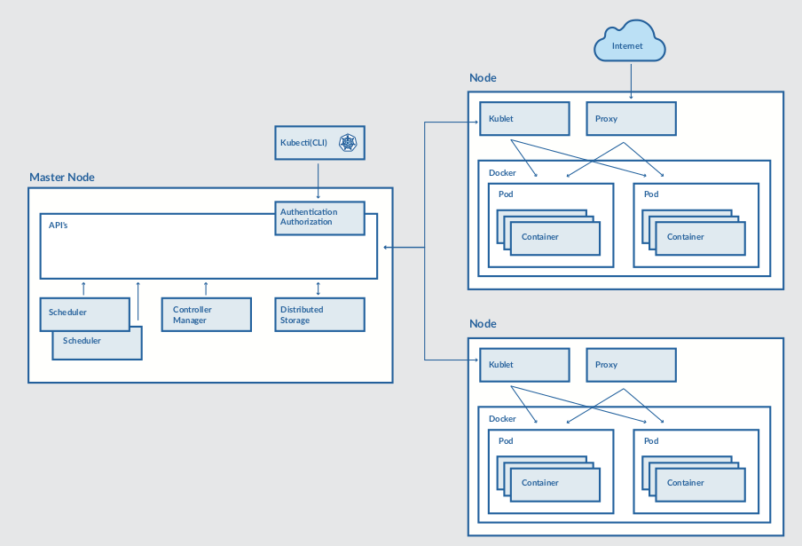

# Main concept in kubernetes
- Kubernetes provides basic mechanism for deployment, maintainance and scaling of containerized applications
- It uses building blocks
    - To maintain the state requested by the user
    - Implementing the transaction from the current observable state to the requested state


## High level architecture
### Data node (data plane)
- Node are bare-metal server, on-premises VMs, or VMs on the cloud provider
- Each node contains:
    - Container runtime such as docker
    - Kubelet: is responsible for managing container
    - Kube-proxy: is responsible for network and load balancing

### Master node (control plane)
- Kubernetes cluster also contains one or more master nodes that run the kubernetes control plane
- It contains:
    - API server: provides JSON over HTTP API
    - Scheduler: select nodes to run container
    - Controller manager: run controllers
    - Distributed storage: such as etcd (a global variable configuration store)

## Kubernetes building block
### POD
- A pod is the smallest deployable unit that is managed by kubernetes
- It is a logical group of one or more containers that share the same IP address and its local cache
- Containers within pod communicate with each other using standard inter-process communication like SystemV semaphores or POSIX share memory
- Like "logical host"

### LABEL
- It is a key/value pair that is attached to kubernetes resource

### SELECTOR
- It is used to organize kubernetes resources that have label
- An equality-based selector defines a condition for selecting resources that have an specific label value
- A set-based selector defines a condition for selecting resources that have a label value within the specifed set of values

### CONTROLLER
- It manages a set of pods and ensures that the cluster is in the specified state
- Pods are managed by Replication controller (RC) are automatically replaced if they fail, get deleted or terminated
- Multiple types of controller such as replication controller (RC), deployment controller (DC), Replica set (RS)
    - #### `Replication controller`
        - It is responsible for running the specified number of pod copies (replicas) across the cluster
        - It only supports equality-based selectors
    - #### `Deployment controller`
        - A deployment defines a desired state for logical group of pods and replicas sets
        - It can be updated, rolled out and rolled back
        - It can be rolled back to an earlier revision if the current deployment is not stable
    - #### `Replica set`
        - It is the next generation of replication controller, It supports set-based selectors

### Service
- A service uses a selector to define a logical group of pods and defines a policy to access 
- There are several types of services such as ClusterIP, NodePort and LoadBalancer
    - ClusterIP exposes pods in cluster
    - NodePort exposes pods to external traffic by forwarding traffic from a port on each node to the container port
    - LoadBalancer exposes pods to external traffic as NodePort, however it also provides a load balancer

### Volume
- A volume is defined at the pod level and is used to preserve data across container crashes
- It is used to share data between containers in a pod
- The same lifecycle as pod

#### Persistent volume (PV)
- It represents a real networked storage unit in a cluster
- It has lifecycle independent of any individual pod

### Persistent volume claim
- It defines a specific amount of storage requested and specific access modes

### JOB
- It is used to create one or more pods and ensures that a specified number of them successfully terminate
- It tracks the succcessful completions, and when a specified number of successful completions is reached, the job ifself is complete
- There are several types of jobs:
    - Non-parallel jobs
    - Parallel jobs with a work queue

### DAEMON SET
- It ensures that all or some nodes run a copy of a pod
- Use case: log collection daemon or a monitoring daemon on each node

### NAMESPACE
- It provides a logical partition of the cluster's resources 
- Different namespaces can be assigned different quatas for resource limitions

### QUOTA
- A quata sets resource limitations such as CPU, memory, number of pods or services, for a given namespace 

## Tips
### Using `labels` and `selectors` for fine-grained control
- Equality-based selector
```text
release: stable
environment: dev
```
- Set-based selector
```text
environment in (dev, test)
environment notin (live)
release = stable, environment = dev
```

### Service discovery
- Kubernetes supports finding a service in 2 ways: through EV or using DNS

