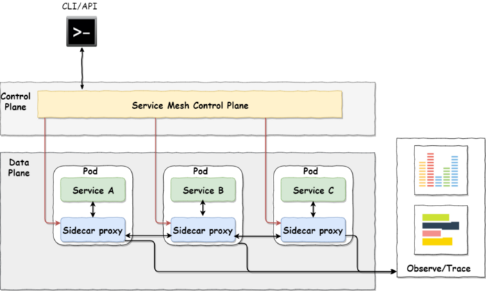
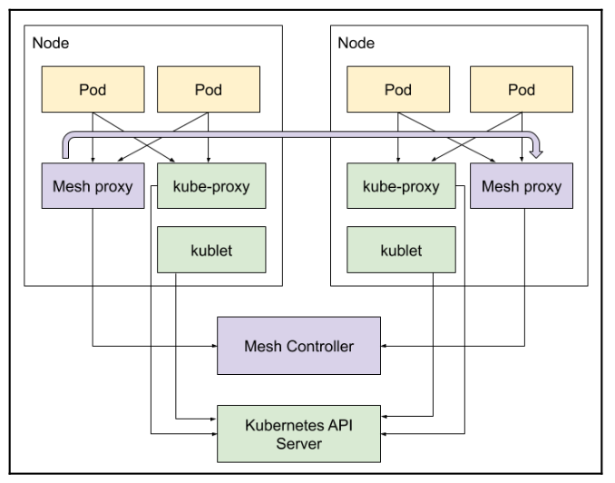
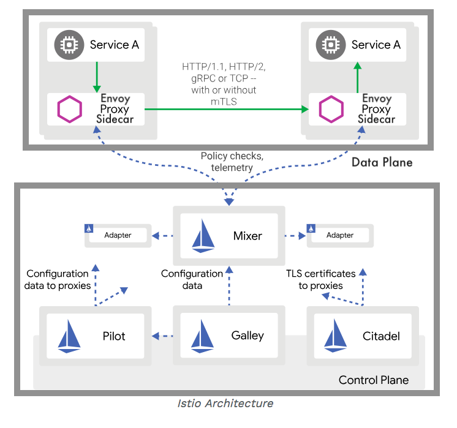

# Service mesh (Istio)
- A service mesh is a set intelligent proxies and additional control infrastructure components
- Like the open source project Istio, is a way to control how different parts of an application share data with one other
- A service mesh is a dedicated infrastructure layer built right into to app
- This visible infrastructure layer can document, so it becomes easier to optimize communication and avoid downtime as an app grows 
- Service-to-service communication (layer 7 in OSI model) is what makes microservice possible => a service mesh becomes more valuable


- In Software-defined-networking, Service mesh is consists of the components can dynamically configure,exchange information and communicate through APIs 
## Benefit
- Visualize service-to-service communication, perfomance metrics of each apps
- Help devs to focus business logic
- Easier to diagnose networking
- To manage the cross-cutting concerns of microservices
    - Reliable delivery of requests between services through retries and automatic failovers
    - Route requests based on flexible and dynamic routing rules
    - Circuit breaking through deadlines
    - Inter-service authentication and authorization
    - Report metrics and support for distributed tracing

## Cons
- The learning curve very steep
- Troubleshooting configuration issues is challenging 
- Increase network latency, consume CPU and memory resources
- Not identify what problem related to integrated system such as: routing type (static or dynamic routing), transformation mapping (http REST <-> gRPC) 

## How does it work
- Take the logic governing service-to-service communication out of individual services and abstracts it to a layer of infrastructure
- A service mesh is built into an apps as an array of network proxies.
    - As a request go out, it first received by proxy
    - Then, navigating to webserver
- In a service mesh, requests are routed between microservices through proxies in their own infrastructure layer
    - Using "sidecar proxy" pattern, they run alongside each service, it decoupled from each service - form a mesh network

 

## The components
- Basically, Service mesh consists of 2 components:
    - Data plane is responsible for:
        - Service discovery
        - Load balancing
        - Authentication and authorization
        - Request tracing, traffic management
        - Fault injection, rate limiting, observability
    - Control plan export API for devops, administrator



- Kubernetes deploys the kubelet and kube-proxy into each node and it interact with kubernetes API server (control plane)
- Service mesh deploys its own proxy, it interact with its own control plane. Such as each Envoy proxy is injected as a sidecar container to each pod

## Istio architecture
- Istio consists of:
    - Data plane is a set proxies (one per pod)
    - Control plane is a set of components that are responsible for configuring the proxies and collecting telemetry of data
    - Envoy: high performance proxy, it are responsible for:
        - Proxy HTTP, HTTP/2, gRPC traffic between pods
        - Load balancing
        - mTLS termination
        - HTTP/2 and gRPC proxies
        - Providing service health
        - Circuit breaking for unhealthy services
        - Percent-based traffic shaping
        - Injecting faults for testing
        - Detailed metrics
    - Mixer: abstracting the metrics collection and policies. Execute policy such as authentication, authorization, identify, rate limits, quotas, tracing requests and gather information from Data plan. The types of backends that Mixer can work:
        - Logging
        - Authorization
        - Quata
        - Telemetry
        - Billing
    - Pilot: is stateless, execute the updates, change configuration of sidecar (at runtime)
    - Citadel: is responsible for issue, change the certificates for authentication, authorization, identifying, encoding
    - Galley: execute related configuration in istio
- [Install document](https://istio.io/latest/docs/setup/install/)



## Managing traffic with istio
- It provides many capabilities such as request routing, load balancing, automatic retries, and fault injection
### Routing requests
- It allows you to configure rules that determine how to route traffic to different versions of a service
    - Pilot sends ingress and egress rules to the proxies that determine where requests should be handled
    - Define a virtual service for the link-manager service
```yaml
apiVersion: networking.istio.io/v1alpha3
kind: VirtualService
metadata:
  name: link-manager
spec:
  hosts:
  - link-manager # same as link-manager.default.svc.cluster.local
  http:
  - route:
    - destination:
      host: link-manager
```
### Load balancing
- There are currently 3 supported LB algorithms:
    - Round robin
    - Random
    - Weighted least request
- Configuring LB through the destination rules
```yaml
apiVersion: networking.istio.io/v1alpha3
kind: DestinationRule
metadata:
  name: link-manager
spec:
  host: link-manager
  trafficPolicy:
    loadBalancer:
      simple: ROUND_ROBIN
```
- Specifying different algorithms by the port
```yaml
apiVersion: networking.istio.io/v1alpha3
kind: DestinationRule
metadata:
  name: link-manager
spec:
  host: link-manager
  trafficPolicy:
    portLevelSettings:
    - port:
        number: 80
      loadBalancer:
        simple: LEAST_CONN
    - port:
        number: 8080
      loadBalancer:
        simple: ROUND_ROBIN
```

### Handling failures
- Istio provides many mechanisms to deal with failure, including the following:
    - Timeouts
    - Retries (including backoff and jitter)
    - Rate limiting
    - Health checks
    - Circuit breakers
- How to set the connection limits and timeout
```yaml
apiVersion: networking.istio.io/v1alpha3
kind: DestinationRule
metadata:
  name: link-manager
spec:
  host: link-manager
  trafficPolicy:
    connectionPool:
      tcp:
      maxConnections: 200
      connectTimeout: 45ms
      tcpKeepalive:
        time: 3600s
        interval: 75s
```
- How to set the circuit breaker with `outlierDetection` section
```yaml
apiVersion: networking.istio.io/v1alpha3
kind: DestinationRule
metadata:
  name: link-manager
spec:
  host: link-manager
  trafficPolicy:
    outlierDetection:
      consecutiveErrors: 10
      interval: 2m
      baseEjectionTime: 5m
```
- Injecting faults for testing. There are 2 types of faults, you can configure fault injection at the virtual service level
    - Aborts
    - Delays
- How to delay 5s to 10% requests
```yaml
apiVersion: networking.istio.io/v1alpha3
kind: VirtualService
metadata:
  name: link-manager
spec:
  hosts:
  - link-manager
  http:
  - fault:
    delay:
      percent: 10
      fixedDelay: 5s
```
- Doing canary deployment
    - Simply configure 2 versions of your service and decide what percentage of requests go to each version
- Configure send 95% to v1, 5% to v2
```yaml
apiVersion: networking.istio.io/v1alpha3
kind: VirtualService
metadata:
  name: link-service
spec:
  hosts:
  - reviews
  http:
  - route:
    - destination:
      host: link-service
      subset: v1
      weight: 95
    - destination:
      host: reviews
      subset: v2
      weight: 5
```
- How to define subnets in a destination rule based on labels
```yaml
apiVersion: networking.istio.io/v1alpha3
kind: DestinationRule
metadata:
  name: link-manager
spec:
  host: link-manager
  subsets:
  - name: v1
    labels:
      version: v1
  - name: v2
    labels:
      version: v2
```

### Security your cluster with Istio
- Related theme: identity, authentication and authorization
#### Identity 
- Istio manages its own identity model, which can represent human users, services or groups of services
- Using PKI to create a strong cryptographic identity for each pod that it manages
- Pilot manages a map between the DNS service names and the identities 
#### Authentication users
- Policies are resolved from `a service` -> `a namespace` -> `a mesh`
- Istio provides peer authentication through mTLS or origin authentication through JWT
- Istio authentication is based on policies. There are 2 type of policies:
    - Namespace policy apply to a single namespace. Note: only one policy per namespace, default is default namespace
    - Mesh policy applies to the entire cluster. Note: only one policy per cluster
- MeshPolicy require all services to use mTLS
```yaml
apiVersion: "authentication.istio.io/v1alpha1"
kind: "MeshPolicy"
metadata:
  name: "default"
spec:
  peers:
  - mtls: {}
```
- Using origin authentication through JWT
```yaml
apiVersion: "authentication.istio.io/v1alpha1"
kind: "MeshPolicy"
metadata:
  name: "default"
spec:
  origins:
  - jwt:
    issuer: "https://accounts.google.com"
    jwksUri: "https://www.googleapis.com/oauth2/v3/certs"
    trigger_rules:
    - excluded_paths:
      - exact: /healthcheck
```
- To force origin authentication, using `principalBinding: USE_ORIGIN` to policy
- Using targets selector to apply only to the api-gateway service and port 8080
```yaml
apiVersion: "authentication.istio.io/v1alpha1"
kind: "Policy"
metadata:
  name: "default"
  namespace: "some-ns"
spec:
  targets:
  - name: api-gateway
  - name: link-manager
  ports:
  - number: 8080
```

#### Authorizing requests
- RBAC of kubernetes: Role, ClusterRole, RoleBinding and ClusterRoleBinding
- RBAC of Istio: ServiceRole and ServiceRoleBinding
- The basic level of granularity is `namespace`/`service`/`path`/`method`
- Authorization is turned off by default. To turn on, you can create a `ClusterRbacConfig` object. The mode controls how authorization is enabled:
    - `OFF` : authorization is disabled
    - `ON` : authorization is enabled for all services
    - `ON_WITH_CLUSION` : authorization is enabled for all the included namespaces and services 
    - `ON_WITH_EXCLUSION` : authorization is enabled for all namespaces and service except the excluded ones
- For example, Creating service role:
```yaml
apiVersion: "rbac.istio.io/v1alpha1"
kind: ClusterRbacConfig
metadata:
  name: default
spec:
  mode: 'ON_WITH_EXCLUSION'
  exclusion:
    namespaces: ["kube-system", "development"]
```
```yaml
apiVersion: "rbac.istio.io/v1alpha1"
kind: ServiceRole
metadata:
  name: full-access-reader
  namespace: default
spec:
  rules:
  - services: ["*-manager", "api-gateway"]
    paths:
    methods: ["GET", "HEAD"]
```
- For example, create service role binding:
```yaml
apiVersion: "rbac.istio.io/v1alpha1"
kind: ServiceRoleBinding
metadata:
  name: test-binding-products
  namespace: default
spec:
  subjects:
  - user: "service-account-delinkcious"
  - user: "istio-ingress-service-account"
    properties:
      request.auth.claims[email]: "the.gigi@gmail.com"
  roleRef:
    kind: ServiceRole
    name: "full-access-reader"
```

#### Enforcing policies
- Policy enforcement is disabled by default. If installing with helm, you can enable it `--set global.disablePolicyChecks=false`
- How to check
```bash
kubectl -n istio-system get cm istio -o jsonpath="{@.data.mesh}" | grep disablePolicyChecks
---
disablePolicyChecks: falsebash

```
- Mixer has a set of adapters that are invoked before and after a request is processed
- How to apply rate limiting
```yaml
apiVersion: config.istio.io/v1alpha2
kind: handler
metadata:
  name: quotahandler
  namespace: istio-system
spec:
  compiledAdapter: memquota
  params:
    quotas:
    - name: requestcountquota.instance.istio-system
      maxAmount: 500
      validDuration: 1s
      # The first matching override is applied.
      # A requestcount instance is checked against override dimensions.
      overrides:
      # The following override applies to 'reviews' regardless
      # of the source.
      - dimensions:
          destination: reviews
        maxAmount: 1
        validDuration: 5s
      # The following override applies to 'productpage' when
      # the source is a specific ip address.
      - dimensions:
          destination: productpage
          source: "10.28.11.20"
        maxAmount: 500
        validDuration: 1s
      # The following override applies to 'productpage' regardless
      # of the source.
      - dimensions:
          destination: productpage
        maxAmount: 2
        validDuration: 5s
---
apiVersion: config.istio.io/v1alpha2
kind: instance
metadata:
  name: requestcountquota
  namespace: istio-system
spec:
  compiledTemplate: quota
  params:
    dimensions:
      source: request.headers["x-forwarded-for"] | "unknown"
      destination: destination.labels["app"] | destination.service.name | "unknown"
      destinationVersion: destination.labels["version"] | "unknown"
---
apiVersion: config.istio.io/v1alpha2
kind: QuotaSpec
metadata:
  name: request-count
  namespace: istio-system
spec:
  rules:
  - quotas:
    - charge: 1
      quota: requestcountquota
---
apiVersion: config.istio.io/v1alpha2
kind: QuotaSpecBinding
metadata:
  name: request-count
  namespace: istio-system
spec:
  quotaSpecs:
  - name: request-count
    namespace: istio-system
  services:
  - name: productpage
    namespace: default
    #  - service: '*'  # Uncomment this to bind *all* services to request-count
---
apiVersion: config.istio.io/v1alpha2
kind: rule
metadata:
  name: quota
  namespace: istio-system
spec:
  # quota only applies if you are not logged in.
  # match: match(request.headers["cookie"], "user=*") == false
  actions:
  - handler: quotahandler
    instances:
    - requestcountquota
```
- Adding your own policies by creating a Mixer adapter. There are 3 built-in types of adapters:
    - Check
    - Quota
    - Report

## Collecting metrics
- Istio collects metrics after each request. 
- Metrics are sent to Mixer
- Envoy is the primary producer of metrics, but you can add your own metrics if you wish
- The configuration model of metrics is based on multiple Istio concepts: `attributes`, `instances`, `templates`, `handlers`, `rules`, and `Mixer adapters`
- For example, counting all the request and report
```yaml
apiVersion: config.istio.io/v1alpha2
kind: instance
metadata:
  name: request-count
  namespace: istio-system
spec:
  compiledTemplate: metric
  params:
    value: "1" # count each request
    dimensions:
      reporter: conditional((context.reporter.kind | "inbound") ==
"outbound", "client", "server")
      source: source.workload.name | "unknown"
      destination: destination.workload.name | "unknown"
      message: '"counting requests..."'
    monitored_resource_type: '"UNSPECIFIED"'
```
- Now, we can configure a prometheus handler to receive the metrics. Prometheus is a compiled adapter (which is part of Mixer)
```yaml
apiVersion: config.istio.io/v1alpha2
kind: handler
metadata:
  name: request-count-handler
  namespace: istio-system
spec:
  compiledAdapter: prometheus
  params:
    metrics:
    - name: request_count # Prometheus metric name
      instance_name: request-count.instance.istio-system # Mixer instance name (fully-qualified)
      kind: COUNTER
      label_names:
      - reporter
      - source
      - destination
      - message
```
- Finally, we tie it all together with a rule
```yaml
apiVersion: config.istio.io/v1alpha2
kind: rule
metadata:
  name: prom-request-counter
  namespace: istio-system
spec:
  actions:
  - handler: request-count-handler
    instances: [ request-count ]
```