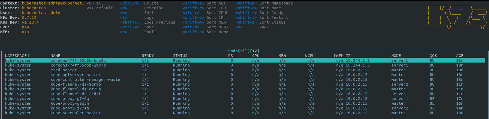
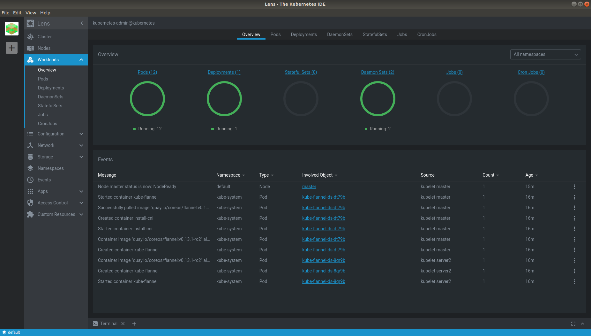

# Tools

## Install docker-compose
```bash
sudo curl -L "https://github.com/docker/compose/releases/download/1.29.0/docker-compose-$(uname -s)-$(uname -m)" -o /usr/local/bin/docker-compose
sudo chmod +x /usr/local/bin/docker-compose
sudo ln -s /usr/local/bin/docker-compose /usr/bin/docker-compose
docker-compose --version
```

## Install snapd with root privilege
```bash
yum install epel-release -y
yum install snapd -y
systemctl enable --now snapd.socket
ln -s /var/lib/snapd/snap /snap
```

## Install k9s in centos 7
```bash
snap install k9s
echo "export K9S_HOME=/var/lib/snapd/snap/k9s/151" >> ~/.bashrc
echo "export PATH='$PATH:$K9S_HOME'" >> ~/.bashrc
source ~/.bashrc
k9s
```



## Install lens in ubuntu 18.04
```bash
snap install kontena-lens --classic
```



## Install NFS server
- Update software
```bash
yum update -y
```

- Install nfs, sharing nfsshare directory
```bash
yum install nfs-utils -y
mkdir /var/nfsshare
chmod -R 755 /var/nfsshare
chown nfsnobody:nfsnobody /var/nfsshare
```

- Start related service
```
systemctl enable rpcbind
systemctl enable nfs-server
systemctl enable nfs-lock
systemctl enable nfs-idmap
systemctl start rpcbind
systemctl start nfs-server
systemctl start nfs-lock
systemctl start nfs-idmap
```

- Config /etc/exports file
```bash
/var/nfsshare    192.168.1.0/24(rw,sync,no_root_squash,no_all_squash)
```

- Apply change
```bash
# Restart nff server
systemctl restart nfs-server
# Make public for nfs service
firewall-cmd --permanent --zone=public --add-service=nfs
firewall-cmd --permanent --zone=public --add-service=mountd
firewall-cmd --permanent --zone=public --add-service=rpc-bind
firewall-cmd --reload
# Enable Writing to NFS volumes with SELinux enforcing on each node
setsebool -P virt_sandbox_use_nfs on
setsebool -P virt_use_nfs on
```

- How to connect in ubuntu 18.04
```bash
apt-get install nfs-common -y
/sbin/mount.nfs 192.168.1.2:/var/nfsshare /mnt/nfs/var/nfsshare/
```

- Test
```bash
df -kh
---
Filesystem                 Size  Used Avail Use% Mounted on
...
192.168.1.2:/var/nfsshare   39G  1.6G   37G   4% /mnt/nfs/var/nfsshare
```

- Permanent NFS mounting with /etc/fstab
```bash
192.168.0.100:/var/nfsshare    /mnt/nfs/var/nfsshare   nfs defaults 0 0
```

- [Reference](https://www.howtoforge.com/nfs-server-and-client-on-centos-7)

## Utils
### Get pods with custom columns
```bash
kubectl get po -o custom-columns=POD:metadata.name,NODE:spec.nodeName -n kube-system
---
POD                              NODE
coredns-74ff55c5b-gjq5x          master
coredns-74ff55c5b-srh74          master
etcd-master                      master
kube-apiserver-master            master
kube-controller-manager-master   master
kube-flannel-ds-cqzmp            master
kube-flannel-ds-rlc2r            server1
kube-flannel-ds-v926r            server2
kube-proxy-25z5b                 server1
kube-proxy-js25w                 server2
kube-proxy-n4m8f                 master
kube-scheduler-master            master
```